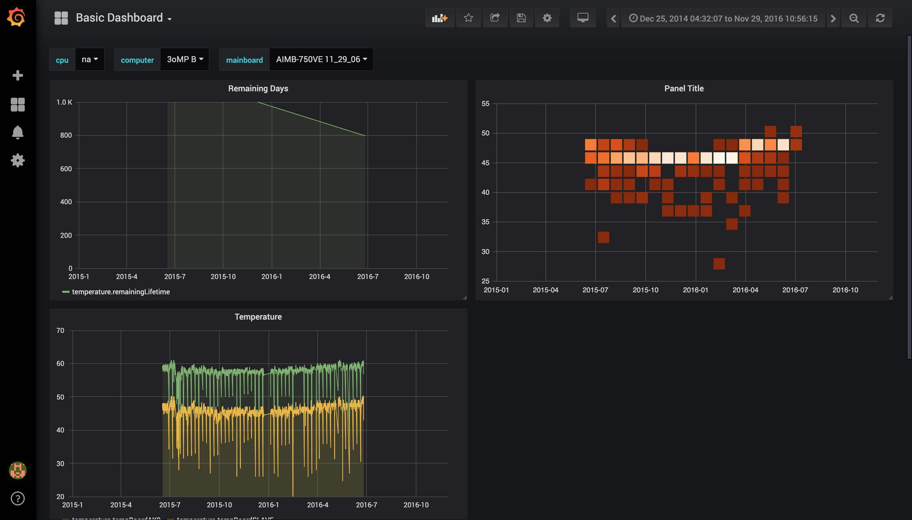

# Seriesly Hot 
## Zeiss Hackathon 2019 - Data Science in the Nano Age

Solution to Challenge 4 - Predictive filter maintenance based on time series data of CPU temperatures.

Team Members:
 - Martin Creutzenberg
 - Mark Dekker
 - Andreas Kröpelin
 - Isabel Povoa
 - Viola Schneider

## What we achieved

- Evaluated a variety of a cloud architectures for the temparature data pipeline and prediction services. A quick overview can be found [here](azure_architectures_solution.pdf).

- Created a user interaction concept where the line manager responsible for the affected machines is notified by an email such as [this](./client_email /) that a given machine is in need of maintenance and why this is important.

- Data exploration, both by exporting the data to influxDB and and exploring it in Grafana. Additionally the data was transformed and processed with pandas dataframes to look for deeper patterns in the data. This work can be found [here](./data_exploration/).

 - Finally a variety of machine learning models were trained to try and predict imminent failures. The techniques attempted were [SVMs, Random Forests](./pipelines/), [A basic Perceptron Neural Net and LSTM Neural Net](model_training_keras.ipynb). None of them produced promising results though.
